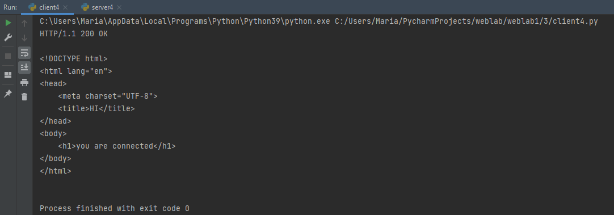

#Задание 3

Реализовать серверную часть приложения. Клиент подключается к серверу. В ответ
клиент получает http-сообщение, содержащее html-страницу, которую сервер
подгружает из файла index.html.

###Реализация сервера
```python
import socket

# получение сообщения от клиента
def get_message():
    data = connection.recv(128).decode()
    log_file.write(f'Message from {address[0]}:{address[1]}: {data}\n')
    return data

# отправка сообщения клиенту
def send_message(msg):
    connection.send(msg.encode())
    log_file.write(f'Message to {address[0]}:{address[1]}: {msg}\n')


log_file = open("server4.log", "w")

socket = socket.socket(socket.AF_INET, socket.SOCK_STREAM)
socket.bind(('localhost', 55555))

socket.listen(1)
connection, address = socket.accept()

html_file = open('index.html', 'rb')
# отправка http ответа, содержащего html страницу
connection.sendall(b"HTTP/1.1 200 OK\r\n\r\n" + html_file.read())

socket.close()
```

###Реализация клиента
```python
import socket

# получение сообщения от сервера
def receive_message():
    message = socket.recv(1024).decode()
    print(message)


server_address = ('localhost', 55555)
socket = socket.socket(socket.AF_INET, socket.SOCK_STREAM)
socket.connect(server_address)

receive_message()

socket.close()
```

###HTML-страница
```html
<!DOCTYPE html>
<html lang="en">
<head>
    <meta charset="UTF-8">
    <title>HI</title>
</head>
<body>
    <h1>you are connected</h1>
</body>
</html>
```


###Пример работы
