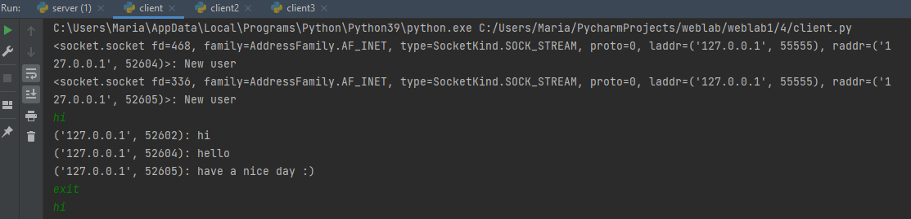

#Задание 4

Реализовать многопользовательский чат. Для применения с TCP необходимо запускать клиентские подключения И прием
и отправку сообщений всем юзерам на сервере в потоках.

###Реализация сервера
```python
import socket
import threading

# отправка сообщения всем клиентам
def send_message(msg, client_address):
    msg = f"{client_address}: " + msg

    for client in clients:
        if client == client_address:
            continue
        client.send(msg.encode())

# получение сообщения от клиента и обработка
def client_work(connection, address):
    while True:
        msg = connection.recv(128).decode()
        if (msg is None) or (msg == 'exit'):
            break
        send_message(msg, address)

    connection.close()


socket = socket.socket(socket.AF_INET, socket.SOCK_STREAM)
socket.bind(('localhost', 55555))
socket.listen()

clients = list()
while True:
    # добавление нового пользователя
    connection, address = socket.accept()
    send_message('New user', connection)
    clients.append(connection)

    # создание потока для нового пользователя
    client_thread = threading.Thread(target=client_work, args=(connection, address))
    client_thread.start()
```

###Реализация клиента
```python
import socket
import threading

#отправка сообщения
def send_message():
    while True:
        msg = input()
        socket.send(msg.encode())

# получение сообщения
def receive_message():
    while True:
        msg = socket.recv(128).decode()
        if not msg:
            break
        print(msg)


socket = socket.socket(socket.AF_INET, socket.SOCK_STREAM)
socket.connect(('localhost', 55555))

# создание двух потоков: для отправки и для получения сообщений
send_thread = threading.Thread(target=send_message)
send_thread.start()
recv_thread = threading.Thread(target=receive_message)
recv_thread.start()
```


###Пример работы


