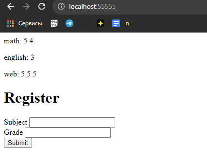

#Задание 5

Необходимо написать простой web-сервер для обработки GET и POST http
запросов средствами Python и библиотеки socket.

###Реализация сервера
```python
import re
import socket

register = dict()

# отправка http сообщения об ошибке
def handle_error():
    response = "HTTP/1.1 405 Method not Allowed\r\n\r\nMethod not supported"
    return response.encode()

# работа с get запросом
def handle_get_request():
    body = '<html><body>'
    # составление журнала
    for key, value in register.items():
        grades = ' '.join(map(str, value))
        body += f"<p>{key}: {grades}</p>"

    # составление формы для ввода оценок по дисциплине
    body += """
    <h1>Register</h1>
    <form method="POST" action="/">
        <label for="subject">Subject</label>
        <input type="text" id="subject" name="subject"><br>
        <label for="grade">Grade</label>
        <input type="number" id="grade" name="grade"><br>
        <input type="submit" value="Submit">
    </form>
    </body></html>
    """
    # составление http ответа
    length = len(body)
    response = f"HTTP/1.1 200 OK\r\nContent-Length: {length}\r\n\r\n{body}"
    return response.encode()

# работа с post запросом
def handle_post_request(request_line):
    # парсинг введенных данных
    valid_request = re.search(r'subject=(\w+)&grade=(\d+)', request_line)
    if valid_request:
        # запись изменений в журнал
        subject = valid_request.group(1)
        grade = valid_request.group(2)
        if subject not in register:
            register[subject] = []
        register[subject].append(grade)

    # составление http ответа
    response = "HTTP/1.1 302 Found\r\nLocation: /\r\n\r\n"
    return response.encode()

# работа с клиентом
def handle_client(connection):
    data = client_connection.recv(1024).decode()
    if data:
        # парсинг запроса
        request_lines = data.split('\r\n')
        request_line = request_lines[0]
        method = request_line.split()[0]
        body = request_lines[-1]

        if method == 'GET':
            response = handle_get_request()
        elif method == 'POST':
            response = handle_post_request(body)
        else:
            response = handle_error()
        # отправка http ответа
        connection.sendall(response)

    connection.close()

server_socket = socket.socket(socket.AF_INET, socket.SOCK_STREAM)
server_socket.bind(('localhost', 55555))
server_socket.listen()

while True:
    client_connection, client_address = server_socket.accept()
    handle_client(client_connection)

server_socket.close()
```

###Пример работы

