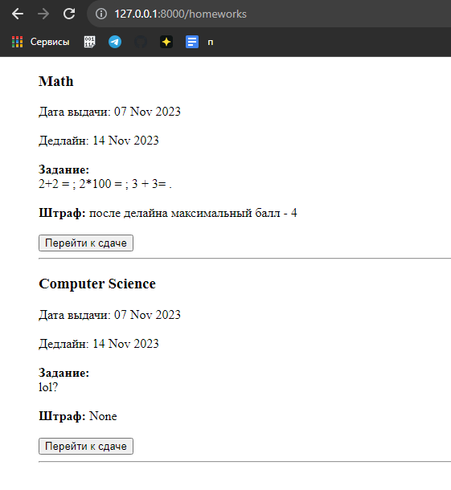

#Просмотр домашних заданий

###Представление для вывода домашних заданий:
```python
def homeworks_view(request):
    hws = dict()
    hws["dataset"] = Homework.objects.all()
    return render(request, "show_all_hws.html", hws)
```


###Шаблон для вывода домашних заданий:
```html
<!DOCTYPE html>
<html lang="en">
<head>
    <meta charset="UTF-8">
    <title>Homeworks</title>
</head>
<body>
    <ul>
        
            <h3>{{object.subject.name}}</h3>
            Дата выдачи: {{object.release_date|date:'d M Y'}}
            <br><br>
            Дедлайн: {{object.deadline|date:'d M Y'}}
            <br><br>
            <strong>Задание:</strong> <br>
            {{object.description}}
            <br><br>
            <strong>Штраф:</strong> {{object.penalty}}
            <br><br>
            <a href="homeworks/new/{{object.id}}"><button>Перейти к сдаче</button></a>
            <hr/>

        
    </ul>
</body>
</html>
```

###Результат:
