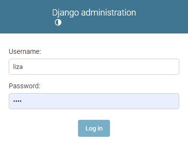
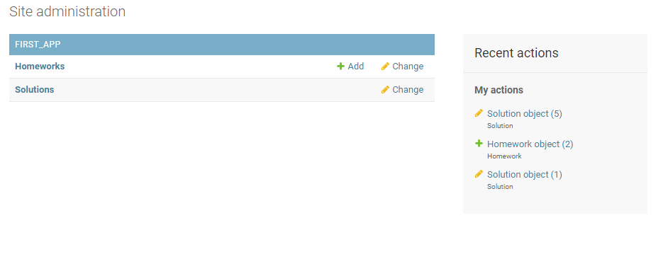

# Выставление оценки

Учителя могут пользоваться админ панелью Django и имеют там уникальные права.
Они могут добавлять, менять, удалять и просматривать домашние задания,
а также просматривать и менять решения (выставление оценки).

