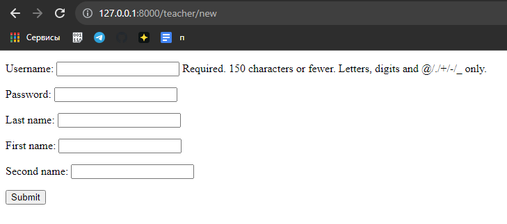
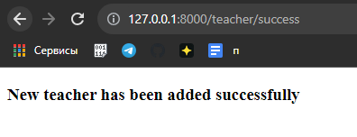

#Регистрация


###Форма для регистрации учителей:

```python
class TeacherForm(forms.ModelForm):
    class Meta:
        model = Teacher
        fields = [
            "username",
            "password",
            "last_name",
            "first_name",
            "second_name",
        ]
```

###Представления для регистрации учителей:
```python
def teacher_form_view(request):
    context = {}
    form = TeacherForm(request.POST or None)
    if form.is_valid():
        user = form.save()
        group = Group.objects.get(name='Teachers')
        user.groups.add(group) #добавление новому пользователю группы
        user.is_staff = True #возможность пользоваться админ панелью
        user.set_password(form.cleaned_data["password"]) #хэширование пароля
        user.save()
        return HttpResponseRedirect('../teacher/success')
    context['form'] = form
    return render(request, "new_user.html", context)


def teacher_add_success_view(request):
    return render(request, "success_page.html")
```

###Шаблоны для регистрации учителей:
```html
<!DOCTYPE html>
<html lang="en">
<head>
    <meta charset="UTF-8">
    <title>New Teacher</title>
</head>
<body>
  <form method="POST" enctype="multipart/form-data">
      
        {{ form.as_p }}
      <input type="submit" value="Submit">
  </form>
</body>
</html>
```

```html
<!DOCTYPE html>
<html lang="en">
<head>
    <meta charset="UTF-8">
    <title>Success</title>
</head>
<body>
  <h3>New teacher has been added successfully</h3>
</body>
</html>
```

###Результат:




###Форма для регистрации учеников:

```python
class StudentForm(forms.ModelForm):
    class Meta:
        model = Teacher
        fields = [
            "username",
            "password",
            "last_name",
            "first_name",
            "second_name",
        ]
```

###Представления для регистрации учеников:
```python
def student_form_view(request):
    context = {}
    form = StudentForm(request.POST or None)
    if form.is_valid():
        user = form.save()
        group = Group.objects.get(name='Students')
        user.groups.add(group) #добавление новому пользователю группы
        user.set_password(form.cleaned_data["password"]) #хэширование пароля
        user.save()
        return HttpResponseRedirect('../student/success')
    context['form'] = form
    return render(request, "new_student.html", context)


def student_add_success_view(request):
    return render(request, "student_success_page.html")
```

###Шаблоны для регистрации учеников:
```html
<!DOCTYPE html>
<html lang="en">
<head>
    <meta charset="UTF-8">
    <title>New Student</title>
</head>
<body>
  <form method="POST" enctype="multipart/form-data">
      
        {{ form.as_p }}
      <input type="submit" value="Submit">
  </form>
</body>
</html>
```

```html
<!DOCTYPE html>
<html lang="en">
<head>
    <meta charset="UTF-8">
    <title>Success</title>
</head>
<body>
  <h3>New student has been added successfully</h3>
</body>
</html>
```

###Результат:


