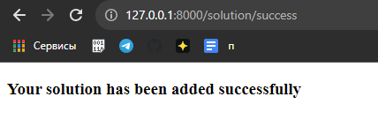

#Сдача домашних заданий

###Форма для сдачи домашних заданий:
```python
class SolutionForm(forms.ModelForm):
    class Meta:
        model = Solution
        fields = [
            "student",
            "solution_text",
        ]
```

###Представления для сдачи домашних заданий:
```python
def solution_form_view(request, hw_id):
    context = {}
    form = SolutionForm(request.POST or None)
    homework = Homework.objects.get(pk=hw_id)

    if form.is_valid():
        solution = form.save(commit=False) #не коммит, потому что fk homework еще не прописан
        solution.homework = homework
        solution.save()
        return HttpResponseRedirect('../../solution/success')

    context['form'] = form
    context['homework'] = homework
    return render(request, "new_solution.html", context)


def solution_add_success_view(request):
    return render(request, "solution_success_page.html")
```


###Шаблоны для сдачи домашних заданий:
```html
<!DOCTYPE html>
<html lang="en">
<head>
    <meta charset="UTF-8">
    <title>New Solution</title>
</head>
<body>
    <h3>{{ homework.subject.name }}</h3>
    <p><strong>Задание:</strong> {{homework.description}}</p>
    <form method="POST" enctype="multipart/form-data">
        
        {{ form.as_p }}
        <input type="submit" value="Submit">
    </form>
</body>
</html>
```
```html
<!DOCTYPE html>
<html lang="en">
<head>
    <meta charset="UTF-8">
    <title>Success</title>
</head>
<body>
  <h3>Your solution has been added successfully</h3>
</body>
</html>
```

###Результат:

